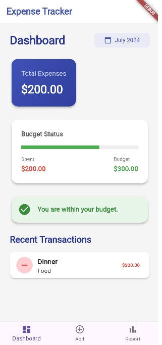
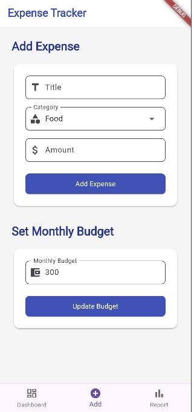
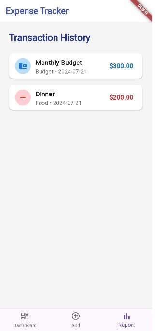

# Expense Tracker App

## Overview

The Expense Tracker App is a simple, local state management-based Flutter application designed to help users manage their expenses and set budgets. This app does not use any external database; all data is stored in variables within the app.

## Features

- **Dashboard**: Displays total expenses, the current month, and recent transactions.
- **Add Page**: Allows users to add expenses, select categories, and set a budget.
- **Report Page**: Shows the transaction history of the user.

## Screenshots

### Dashboard                                                       ### Add Page
          

### Report Page


## Functionality

### Dashboard

- **Total Expense**: Displays the total amount of expenses.
- **Month**: Shows the current month.
- **Recent Transactions**: Lists recent transactions for quick overview.

### Add Page

- **Add Expenses**: Users can input expense details, select a category, and set a budget.
- **Category Selection**: Users can categorize their expenses for better tracking.

### Report Page

- **Transaction History**: Displays a history of all transactions added by the user.

## Getting Started

1. Clone the repository:
   ```bash
   git clone https://github.com/yourusername/expense-tracker-app.git

2. Navigate to the project directory:
   ```bash
   cd expense-tracker-app
   
3. Install dependencies:
   ```bash
   flutter pub get

4. Run the app:
   ```bash
   flutter run

